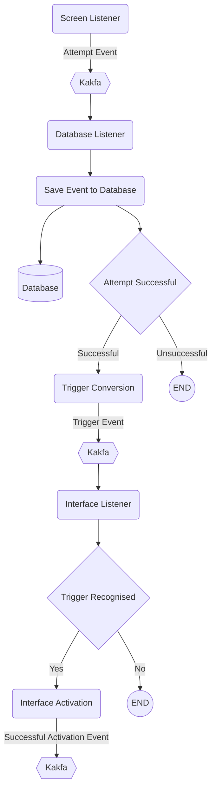

# The Listener Loop

The listener loop happens on all devices in the network. These are either standard devices or database devices.

- Standard Device: No connection to the database, only access to config data and Interfaces
- Database Device: Access to the database. Persists events to the database. Access to the game object.

## Attempt Flow

