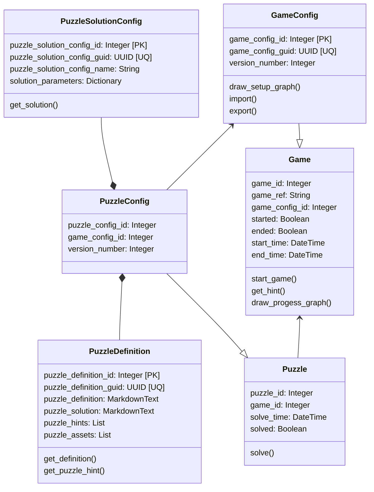

# Puzzle Classes

The game & puzzle classes at the core of the game.

**Game**: The play through of the room. Initiated at a specific time, played to a GameConfig.

**GameConfig**: The configuration of the game. Contains the puzzles, the time limit, and the number of players.

**PuzzleDefinition**: The definition of a puzzle in the abstract. It should include the solution and any hints.

**PuzzleSolutionConfig**: The automated method of generating a puzzle solution. e.g. 4 digit random number, 6 random characters, random choice of prepared tokens, string in random order...

